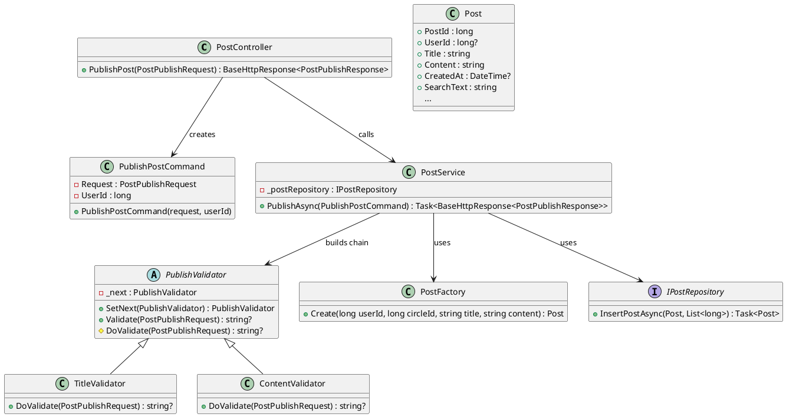

# 重构文档 — PublishPost（按：Controller → PublishPostCommand → ValidatorChain → PostFactory → Repository.Insert）

## 一、修改的源代码部分（新增 / 修改 / 无删除）

### 1.1 新增文件 / 类

* `PublishPostCommand.cs` — **新增**
* `PublishValidator.cs` — **新增（抽象责任链基类）**
* `TitleValidator.cs` — **新增（责任链节点）**
* `ContentValidator.cs` — **新增（责任链节点）**
* `PostFactory.cs` — **新增（工厂方法）**

### 1.2 修改文件 / 类

* `PostController.cs` — **修改**（从直接调用 `_postService.PublishPostAsync(...)` 改为构造 `PublishPostCommand` 并调用 `_postService.PublishAsync(command)`）
* `PostService.cs` — **修改**（新增 `PublishAsync(PublishPostCommand command)` 实现，负责组装 validator chain、调用 factory、调用 repository）
* `PostRepository.cs` — **修改**（暴露/保持 `InsertPostAsync(Post post, List<long> tags)`；若原来为参数式 Insert，此处替换或重载为接受 `Post` 实体的实现）

---

## 二、重构前 / 重构后关键代码对比（只列最重要的部分）

> 说明：左侧为**重构前**（你的原始代码片段简化版），右侧为**重构后**（按最终结构）的实现。

### 2.1 Controller 层

**重构前（Controller 直接调用 Service 的旧签名）**

```csharp
[HttpPost("publish")]
[Authorize(AuthenticationSchemes = "Bearer")]
public async Task<BaseHttpResponse<PostPublishResponse>> PublishPost([FromBody] PostPublishRequest request)
{
    var userId = long.Parse(User.Claims.First(c => c.Type == ClaimTypes.NameIdentifier).Value);
    var post = await _postService.PublishPostAsync(userId,
        request.CircleId ?? 100000,
        request.Title ?? string.Empty,
        request.Content ?? string.Empty,
        request.Tags ?? new List<long>());
    return BaseHttpResponse<PostPublishResponse>.Success(new PostPublishResponse { PostId = post.PostId, CreatedAt = ... });
}
```

**重构后（Controller 仅构造 Command 并调用 Service.PublishAsync）**

```csharp
[HttpPost("publish")]
[Authorize(AuthenticationSchemes = "Bearer")]
public async Task<BaseHttpResponse<PostPublishResponse>> PublishPost([FromBody] PostPublishRequest request)
{
    try
    {
        var userIdStr = User.Claims.FirstOrDefault(c => c.Type == ClaimTypes.NameIdentifier)?.Value;
        if (userIdStr == null) return BaseHttpResponse<PostPublishResponse>.Fail(401, "无法从 Token 中获取用户信息");
        long userId = long.Parse(userIdStr);

        var command = new PublishPostCommand(request, userId);
        return await _postService.PublishAsync(command);
    }
    catch (Exception ex)
    {
        return BaseHttpResponse<PostPublishResponse>.Fail(500, "发帖失败: " + ex.Message);
    }
}
```

---

### 2.2 Service 层

**重构前（非常简单的四参数转发）**

```csharp
public async Task<Post> PublishPostAsync(long userId, long circleId, string title, string content, List<long> tags)
{
    return await _postRepository.InsertPostAsync(userId, circleId, title, content, tags);
}
```

**重构后（使用 Command + ValidatorChain + Factory → Repository）**

```csharp
public async Task<BaseHttpResponse<PostPublishResponse>> PublishAsync(PublishPostCommand command)
{
    try
    {
        var request = command.Request;

        // 1) 构建验证责任链
        var chain = new TitleValidator();
        chain.SetNext(new ContentValidator());

        // 2) 执行校验
        var validationError = chain.Validate(request);
        if (validationError != null)
            return BaseHttpResponse<PostPublishResponse>.Fail(400, validationError);

        // 3) 默认值处理
        long circleId = request.CircleId ?? 100000;
        var tags = request.Tags ?? new List<long>();

        // 4) 使用工厂创建 Post 实体
        var post = PostFactory.Create(command.UserId, circleId, request.Title ?? string.Empty, request.Content ?? string.Empty);

        // 5) 持久化（Repository：InsertPostAsync(Post, List<long>)）
        var inserted = await _postRepository.InsertPostAsync(post, tags);

        // 6) 返回响应 DTO
        return BaseHttpResponse<PostPublishResponse>.Success(new PostPublishResponse
        {
            PostId = inserted.PostId,
            CreatedAt = inserted.CreatedAt?.ToString("yyyy-MM-dd HH:mm:ss") ?? ""
        });
    }
    catch (Exception ex)
    {
        return BaseHttpResponse<PostPublishResponse>.Fail(500, "发帖异常：" + ex.Message);
    }
}
```

---

### 2.3 Repository 层

**重构前**

```csharp
// 旧版：InsertPostAsync(userId, circleId, title, content, tags)
```

**重构后（明确采用实体 + tags 的签名）**

```csharp
public async Task<Post> InsertPostAsync(Post post, List<long> tags)
{
    await using var context = _contextFactory.CreateDbContext();

    // 查 tag names
    var tagNames = new List<string>();
    if (tags?.Count > 0)
    {
        var tagEntities = await context.Tags.Where(t => tags.Contains(t.TagId)).ToListAsync();
        tagNames = tagEntities.Select(t => t.TagName).ToList();
    }

    // 查询用户名与圈子名（用于构建 SearchText）
    var user = await context.Users.Where(u => u.UserId == post.UserId).Select(u => u.Username).FirstOrDefaultAsync();
    var circle = await context.Circles.Where(c => c.CircleId == post.CircleId).Select(c => c.Name).FirstOrDefaultAsync();

    post.SearchText =
        $"<TITLE>{post.Title}</TITLE>" +
        $"<CONTENT>{post.Content}</CONTENT>" +
        $"<TAGS>{string.Join(" ", tagNames)}</TAGS>" +
        $"<USER>{user}</USER>" +
        $"<CIRCLE>{circle}</CIRCLE>";

    context.Posts.Add(post);
    await context.SaveChangesAsync(); // 生成 PostId

    if (tags?.Count > 0)
    {
        foreach (var tagId in tags)
        {
            context.PostTags.Add(new PostTag { PostId = post.PostId, TagId = tagId });
        }
        await context.SaveChangesAsync();
    }

    await context.Entry(post).ReloadAsync();
    return post;
}
```

---

### 2.4 新增的辅助类（完整代码示例）

**PublishPostCommand.cs**

```csharp
public class PublishPostCommand
{
    public PostPublishRequest Request { get; }
    public long UserId { get; }

    public PublishPostCommand(PostPublishRequest request, long userId)
    {
        Request = request;
        UserId = userId;
    }
}
```

**PublishValidator.cs（责任链基类）**

```csharp
public abstract class PublishValidator
{
    protected PublishValidator? _next;
    public PublishValidator SetNext(PublishValidator next) { _next = next; return next; }

    public string? Validate(PostPublishRequest request)
    {
        var err = DoValidate(request);
        if (err != null) return err;
        return _next?.Validate(request);
    }

    protected abstract string? DoValidate(PostPublishRequest request);
}
```

**TitleValidator.cs**

```csharp
public class TitleValidator : PublishValidator
{
    protected override string? DoValidate(PostPublishRequest request)
    {
        if (string.IsNullOrWhiteSpace(request.Title)) return "标题不能为空";
        if (request.Title!.Length > 200) return "标题长度不能超过200";
        return null;
    }
}
```

**ContentValidator.cs**

```csharp
public class ContentValidator : PublishValidator
{
    protected override string? DoValidate(PostPublishRequest request)
    {
        if (string.IsNullOrWhiteSpace(request.Content)) return "内容不能为空";
        if (request.Content!.Length > 20000) return "内容过长";
        return null;
    }
}
```

**PostFactory.cs**

```csharp
public static class PostFactory
{
    public static Post Create(long userId, long circleId, string title, string content)
    {
        return new Post
        {
            UserId = userId,
            CircleId = circleId,
            Title = title,
            Content = content,
            CreatedAt = DateTime.UtcNow,
            IsDeleted = 0,
            IsHidden = 0,
            Views = 0,
            Likes = 0,
            Dislikes = 0
        };
    }
}
```

---

## 三、重构前后的主要差异（总结）

1. **职责分离**

   * 前：Controller/Service/Repository 的职责部分重叠（Controller 有业务判断，Service 仅透传参数或包含多步逻辑）。
   * 后：Controller 仅负责身份提取与路由 → 构造命令并转交 Service；Service 负责协调验证链与工厂并调用 Repository；Repository 专注于持久化。
2. **代码清晰度与可维护性提升**

   * 验证逻辑从零散 if/throw 中抽离为责任链节点（`TitleValidator`、`ContentValidator`），便于单测与扩展（新增校验只需新增节点并插入链中）。
3. **可扩展性（开放-封闭）**

   * 未来新增校验、限流、审核、反垃圾等只需新增相应 Validator 或在 Service 中插入新链节点/步骤；不同帖子类型可通过不同的 Command/Factory 支持。
4. **并行开发友好**

   * 不同同学可分别实现 Validator、Factory、Repository 的具体方法，合并冲突小。
5. **更好的单元测试与 Mock 支持**

   * Validator、Factory、Repository 都是独立类或方法，易于 Mock 与单测。
6. **复用**

   * `PostFactory` 可被其他模块（例如 Admin 快速发布、批量导入）复用。
7. **错误处理集中化**

   * Service 捕获异常并返回统一 `BaseHttpResponse<T>`，Controller 层处理更少的异常分支。

---

## 四、PlantUML 类图



---

## 五、进行修改的原因（更详细）与带来的好处（面向评审写法）

### 5.1 修改原因

* **重复代码与职责混淆**：原有流程中，Controller 有解析 token、默认值、较多校验与异常处理；Service 有时仅做参数转发或混合了多步流程；Repository 有时也包含组合逻辑。违反单一职责原则（SRP）。
* **扩展性差**：新增一个校验（如敏感词/机器审核）或新增一种帖子类型（投票帖/链接帖）需要修改多个地方，违背开闭原则。
* **难以写单元测试**：业务逻辑分散在长方法中，Mock/Stub 变麻烦，测试覆盖困难。
* **团队协作阻碍**：多人改同一方法时冲突多，不利分工并行。

### 5.2 重构带来的好处

* **职责清晰**：Controller 担责路由与鉴权，Service 协调（编排验证+构造+持久化），Repository 专注持久化，Validator 专注校验，Factory 专注实体创建。
* **便于扩展**：增加新校验只需新增 Validator 并在链上挂上即可；支持不同发布策略只需新增 Command/Factory 组合，不改核心 Service。
* **提高测试性**：每个节点（Validator、Factory、Repository）可以单独编写单元测试，Service 的集成测试只需 Mock repository 与 validator（或直接使用真实 validator）。
* **改进代码可读性**：Service 主流程清晰，异常处理与错误码统一，便于审阅与维护。
* **利于课设评分点**：明确展示了责任链（行为型）、工厂（创建型）、命令（行为型/结构化）三种模式的实际落地，符合课程“应用设计模式”的评估要求。

## 六、本次重构使用到的设计模式

### **6.1、创建型设计模式（Creational Patterns）**

* **工厂方法（Factory Method）**
  用于通过 `PostFactory.Create()` 统一构建 `Post` 实体，封装实体默认值与构造细节。

---

### **6.2、行为型设计模式（Behavioral Patterns）**

* **命令模式（Command Pattern）**
  使用 `PublishPostCommand` 封装 Controller → Service 的所有输入参数，使发布操作结构化、可扩展、可测试。

* **责任链模式（Chain of Responsibility）**
  使用 `PublishValidator`、`TitleValidator`、`ContentValidator` 构成验证链，实现请求在多个验证节点之间顺序传递、易于扩展校验逻辑。


